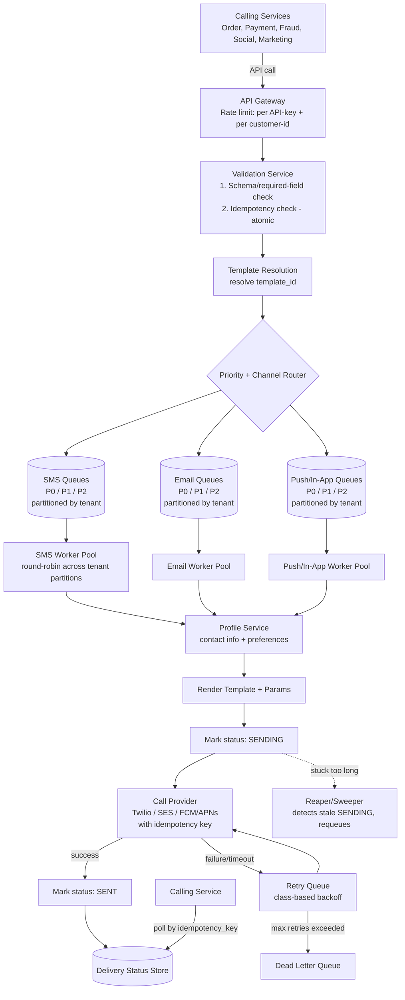

# Notification System Design

## 1. Problem Statement

Design a system that sends notifications to end users across multiple channels (push, email, SMS, in-app) on behalf of 50+ internal services (order updates, payment alerts, social interactions, marketing campaigns, security/OTP).

## 2. Requirements

### Functional
- Accept notification requests from internal calling services via API.
- Support multiple channels: SMS, email, push, in-app/social.
- Support priority tiers (e.g., P0/P1/P2) per notification.
- Respect user notification preferences (opt-in/opt-out per channel), except for non-optable categories (security, OTP, legal/compliance).
- Provide delivery status visibility to calling services.
- Prevent duplicate notifications on caller retries.

### Non-Functional
- **Scale:** ~500M notifications/day (avg ~5,800 QPS), with bursts of 5–10x during events (flash sales, incidents).
- **Isolation:** One noisy internal service must not degrade delivery for others (multi-tenancy).
- **Reliability:** At-least-once delivery, with duplicate window minimized (not necessarily exactly-once).
- **Availability:** Ingestion path must stay up even if downstream dependencies (profile service, providers) are degraded.
- **Extensibility:** Onboarding a new internal service should not require redesigning the queueing model.

### Assumptions
- Priority mix: 5% P0 (critical/transactional), 35% P1 (transactional), 60% P2 (bulk/marketing).
- Channel mix: 40% push, 30% email, 20% SMS, 10% in-app.
- Calling services own idempotency keys (only they know if a request is a genuine retry vs. a new event).

---

## 3. High-Level Architecture

---

## 4. Key Design Decisions & Rationale

### 4.1 Client-owned idempotency keys
The calling service generates and owns the idempotency key, not the ingestion service. Only the caller knows whether two requests represent a genuine retry or two distinct events. The ingestion service cannot reliably infer this.

- **Dedup key:** `(service_id, message_id)` — not `message_id` alone, to avoid cross-tenant collisions.
- **Check mechanism:** Atomic check-and-set (e.g., Redis `SETNX`, or a DB unique constraint with insert-fails-on-conflict). A "write-behind cache" is explicitly wrong here — it allows a race window where two near-simultaneous duplicate requests both see a cache miss.
- **Dedup window:** Varies by message class (e.g., 1 hour for payment/transactional, 24 hours for weekly digests) based on realistic caller retry/replay behavior.

### 4.2 Validation ordering
Cheapest checks first: schema/required-field validation (in-memory, near-zero cost) before idempotency check (I/O call). Fail fast on malformed requests before paying for a cache/DB round-trip.

### 4.3 Decoupling contact/template resolution from ingestion
Profile lookup (contact info + preferences) and template rendering happen **on the consumer side of the queue**, not during ingestion.

- **Why:** Keeps the ingestion path fast and decoupled from downstream dependency health. If profile service degrades, queues back up — but ingestion keeps accepting new requests from unrelated services.
- **Template params travel inline in the queue message** (not looked up via a separate DB call at dispatch time). Queue payload size was never the real constraint — the number of network hops on the dispatch hot path is. An extra ~500 bytes per message is a non-issue for modern queue systems; an extra DB round-trip per message, multiplied across peak QPS, is not.
- Queue message shape: `(customer_id, channel, priority, template_id, template_params, idempotency_key)`.

### 4.4 Priority + tenant isolation (avoiding noisy-neighbor problems)
Two distinct problems, solved separately:

| Problem | Symptom | Fix |
|---|---|---|
| Priority isolation | P2 marketing floods delay P0 alerts | Separate queues per (channel × priority) — e.g., 3 channels × 3 priorities = up to 9 queues |
| Tenant isolation | Two services *within the same priority tier* compete; one crowds out the other even while both are under their own rate limit | Partition each queue by tenant/service; worker pool consumes **fairly (round-robin/weighted) across partitions**, not by draining one partition before moving to the next |

Rate limiting (per API-key, per customer-id) solves a different problem — capping one caller's absolute volume — and does **not** by itself solve fair sharing of a queue's throughput across tenants who are each within their own limits.

**v1 vs v2 trade-off:** Start with shared partitioned queues; graduate a tenant to a dedicated topic + worker pool only once their volume justifies the operational overhead. Avoids requiring infra changes every time a new consumer onboards.

### 4.5 Delivery guarantees (at-least-once, not exactly-once)
Failure scenario: worker calls provider successfully, crashes before acking the queue message → message gets redelivered → risk of double-send.

Mitigations (not a full elimination — be explicit about this):
- Mark message state `SENDING` before calling the provider.
- Pass the idempotency key to the provider itself (Twilio/SES/FCM support this in varying degrees) so an accidental duplicate call can be no-op'd by the provider.
- A **reaper/sweeper process** periodically scans for messages stuck in `SENDING` beyond a timeout and requeues them — because a crashed worker never gets to run its own failure-handling code.

**Honest framing for an interview:** "Delivery is at-least-once; we've engineered the duplicate window down to milliseconds, not eliminated it. True exactly-once isn't worth the added complexity for this class of problem."

### 4.6 Preferences vs. priority
Priority level (P0/P1/P2) does **not** override user preference by itself — that would let any calling service bypass opt-out simply by mislabeling their message as P0.

Instead: a small, hard-coded **allowlist of non-optable categories** (security alerts, OTP, legal/compliance notices) bypasses preference, regardless of priority label. All other categories — including urgent-sounding marketing — respect user preference.

### 4.7 Retry policy — class-based, in a separate delay queue
Retry count and backoff depend on message class:
- Transactional/fraud/security: short backoff, few retries, favor speed.
- Campaigns/bulk: longer backoff, fewer retries, favor not spamming a flaky provider.

Retries go into a **separate delayed-retry queue**, not back into the live priority queue — otherwise a provider having a bad few minutes fills the live P0 queue with retries competing against fresh messages. Messages exceeding max retries go to a **dead-letter queue** for manual/automated inspection.

### 4.8 Delivery status visibility
**v1: Polling.** Calling service queries status by idempotency key. Stateless for the notification service, no new delivery-guarantee problem introduced.

**v2 (deferred): Webhook callbacks.** Pushing status to a caller-registered URL is better UX, but introduces the same at-least-once delivery problem in reverse (what if the caller's endpoint is down?) — effectively rebuilding the SMS-delivery reliability problem for callbacks. Deliberately deferred until polling proves out real usage patterns and demand.

---

## 5. Open Threads (not covered in depth)

- **Observability:** queue depth per partition, delivery success rate per provider, p99 dispatch latency per channel, dead-letter queue size as a leading alert signal.
- **Multi-region/DR:** active-active vs. active-passive for the ingestion and queue layer; regional provider failover (e.g., secondary SMS gateway).
- **Capacity planning specifics:** QPS breakdown per channel, storage sizing for message/delivery records (30-day retention), idempotency store sizing at peak, buffering strategy when provider rate limits are below peak demand.

---

